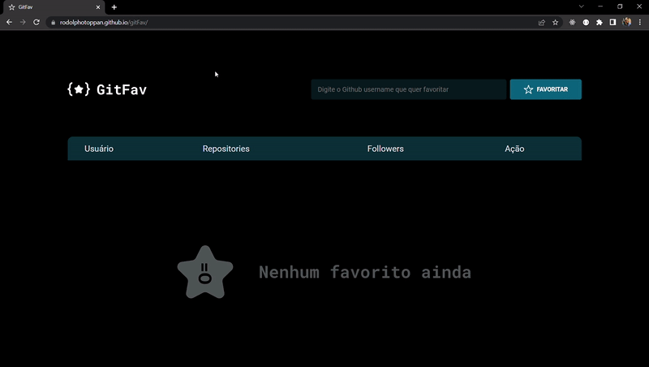

# GitFav

Esse projeto é voltado para qualquer pessoa que tenha uma conta no Github. Essa aplicação adiciona qualquer conta do Github como favorita e deixa salva com alguns dados selecionados.

## Demonstração

## Stack utilizada

**HTM, CSS, Javascript**

## Funcionalidades

- Pesquisar perfis do Github
- Favoritar perfil
- Deletar perfil
- Não permite favoritar o mesmo perfil mais de uma vez

## 🔗 Links

